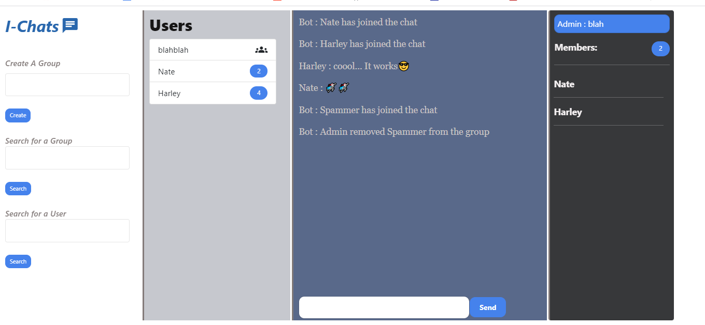

# I-Chats 💬

I-Chats (Internet Chats) is a realtime Chat app made with Socket.io and Node.js.

## Features
* User can create groups/rooms to chat.
* User can search for a group to join a group 
* User can search for another user (private messaging).
* If no group/user is found during the search, a message regarding that will be displayed.

### Admin privileges
* #add_user <user_name> - To add a user
* #remove_user <user_name> - To remove a user

### Member privileges
* #leave_group <group_name>
